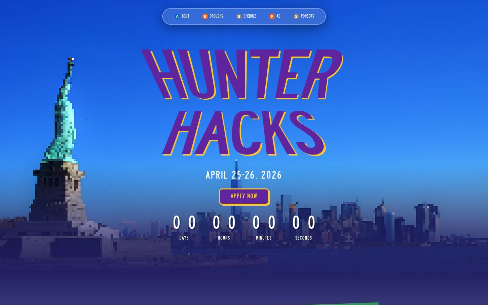
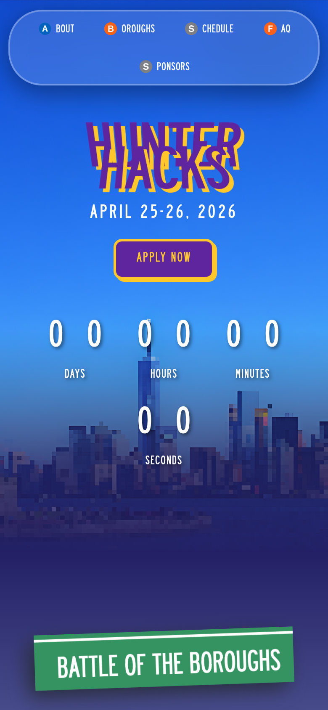
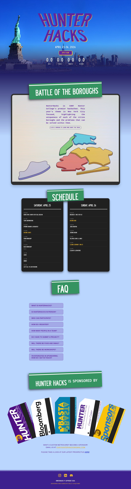
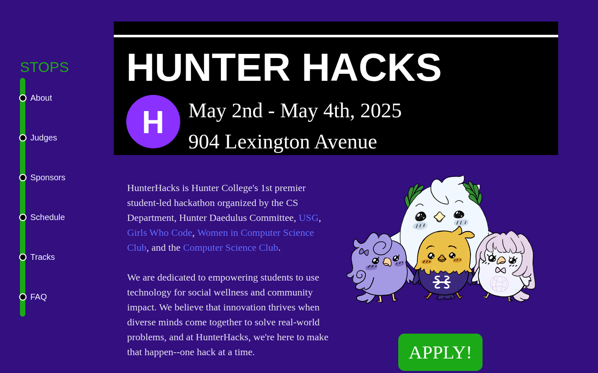
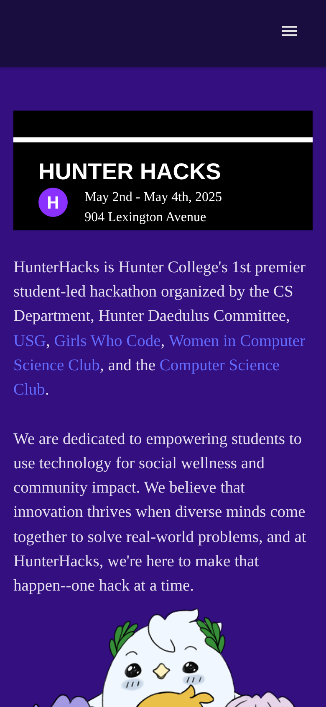
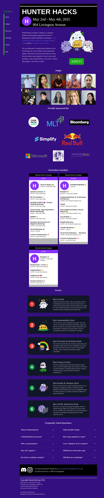

# HunterHacks

HunterHacks is Hunter College's premier student-led hackathon, organized by the CS Department, the Hunter Daedalus Committee, USG, Girls Who Code, the Women in Computer Science Club, and the Computer Science Club. It's dedicated to empowering students to use technology for social wellness and community impact, bringing beginner and experienced hackers together to ideate, design, and build over one exciting weekend.

This repository holds the site for every HunterHacks edition, each in its own folder.

## Editions

| Year | Theme | Dates | Website | Code & docs |
|---|---|---|---|---|
| 2026 | Battle of the Boroughs | April 25–26, 2026 | [hunterhacks.com](https://hunterhacks.com) | [hunterhacks-2026](./hunterhacks-2026/README.md) |
| 2025 | — | May 2–4, 2025 | — | [hunterhacks-2025](./hunterhacks-2025/README.md) |

## 2026 — Battle of the Boroughs

This year's theme puts a spotlight on New York City, celebrating what makes each of the five boroughs unique and the problems that can be solved within them. The site opens on a pixel-art skyline of the city with the Statue of Liberty, leading into an interactive borough map where hovering over the Bronx, Manhattan, Staten Island, Brooklyn, or Queens reveals that borough's track theme and bird mascot. Sponsors are shown as a fanned hand of subway MetroCards, keeping the transit motif going all the way to the footer.

  
  

View full page

## 2025

The 2025 site leans into a subway-themed navbar, with each section styled as a stop along the train line, plus a mobile hamburger menu. Bird mascots reappear throughout the page, and the schedule cards ("Planned Service Changes") echo MTA service alert signage. Six hackathon tracks, each with its own subway-line icon and bird, round out the page alongside judges, sponsors, and an FAQ.

  
  

View full page

## Technical docs

Setup instructions, architecture notes, and component/file breakdowns live in each year's own README:
- [hunterhacks-2026/README.md](./hunterhacks-2026/README.md)
- [hunterhacks-2025/README.md](./hunterhacks-2025/README.md)

## Team

- Kelly Lin: Lead Designer & Lead Developer
- [Ynalois Pangilinan](https://github.com/ynaloisp): Developer
- [Kyle Bautista](https://github.com/KymaiselHunter): Lead Developer
- [Natalie Gallo](https://github.com/natalie-gallo): Developer
- [Emily Klapper](https://github.com/emiklap): Developer
- [Maggie Ma](https://github.com/maggeema): Developer
- Tahya Mumtahi: Contributor
- Fariha Kha: Contributor
